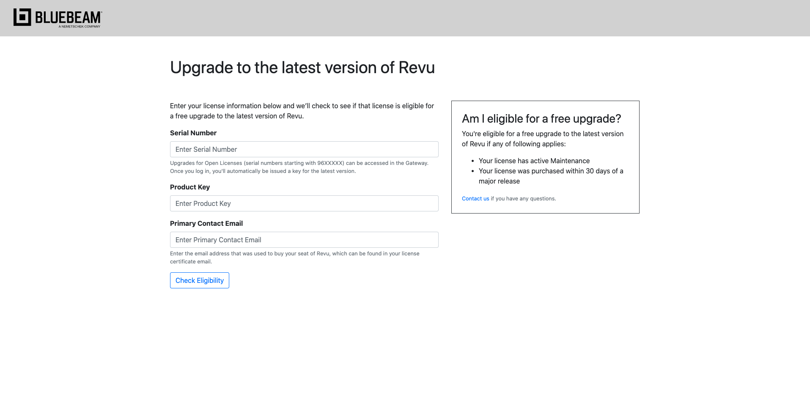
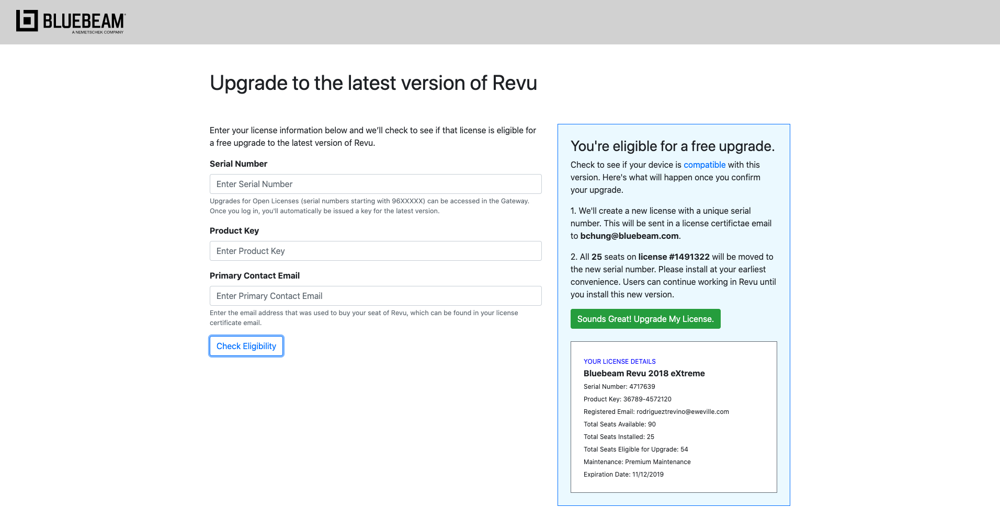
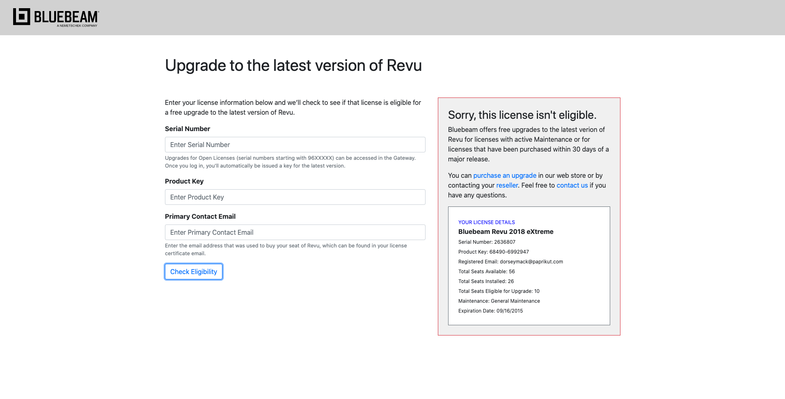
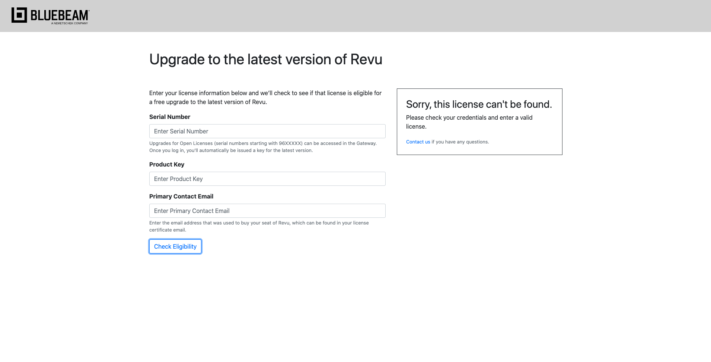

# Bluebeam Self-Upgrade Licensing App

https://jsfiddle.net/jahpe777/w375yop4/14/

## App Summary

The "Bluebeam Self-Upgrade Licensing App" gives customers the ability to enter their licensing information to check and see if they’re eligible for an upgrade. If eligible, we provide them with an easy way to upgrade their product.

## Technologies Used

JavaScript / Bootstrap / CSS / HTML

## Screenshots

### License Initial Page:

### License Eligible Page:

### License Not Eligible Page:

### License Not Found:

